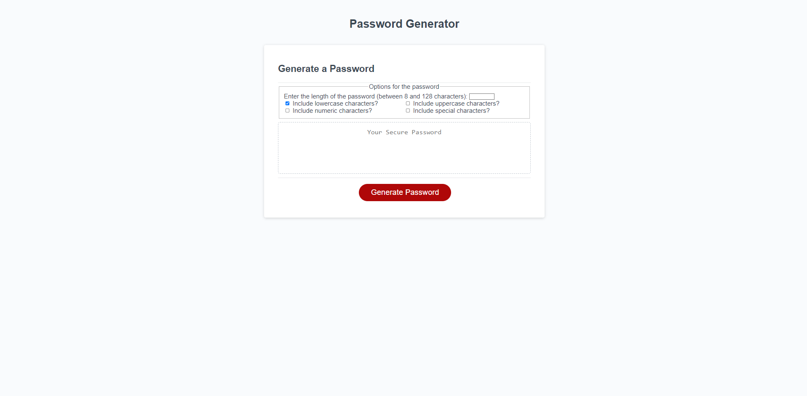

# JS-Awesome-Password-Generator

With the **JS-Awesome-Password-Generator** you won't need to worry anymore for have secured passwords, with a few clicks you can choose between options to fill your needs.

## Table of Contents

- [Features](#features)
- [Installation](#installation)
- [Usage](#usage)
- [Contributing](#contributing)
- [License](#license)
- [Contact](#contact)
- [Deployment](#deployment)

## Features

- Generate random passwords with customizable criteria.
- Select password length between 8 and 128 characters.
- Include or exclude lowercase, uppercase, numeric, and special characters.
- Validation and error handling for user inputs.

## Installation

1. Clone the repository from  or download the source code.
2. Open the `index.html` file in a web browser.

## Usage

1. Open the web app in a web browser.
2. Select the desired criteria for the password.
3. Click on the "Generate Password" button.
4. A awesome random password will be generated and displayed in the textarea.

## Contributing

Contributions are welcome! If you encounter any issues or have suggestions for improvements, please feel free to submit a pull request or create an issue in the repository.

## License

This project is licensed under the [MIT License](LICENSE).

## Contact

If you have any questions or want to connect, feel free to reach out to me:

- Email: didierthomas.m@gmail.com
- Github: [didierthomasm](https://github.com/didierthomasm/)

## Deployment
<https://didierthomasm.github.io/js-awesome-password-generator>